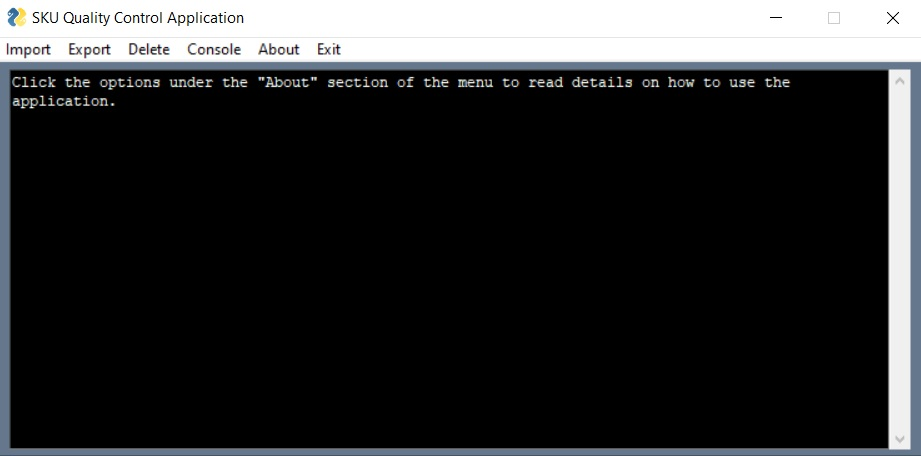

# SKU Quality Control Application

## Introduction

The purpose of _SKU Quality Control application_ is to investigate the atypical purchases that are
recorded in one audit period.
The process of finding atypical purchases reaches the SKU level per store
of the _Emrc Retail Audit sample._

The distance measure which is used to implement the above, based on Shanon’s theory, is the
following:

## An example

A typical example that describes this property is the following:
We have 2 stores where the purchases for the same SKU in 2 consecutive periods are

We immediately observe the doubling of the purchases in the period t + 1, that is, we have a 100%
increase in both stores. Here, the increase in store A should not worry us because it is reasonable and
expected to buy an additional SKU and we must pay attention to store B, something that the classic
distance measures do not indicate.
However, by using the above type of distance, we obtain

## Implementation

This application implements the following 2 procedures.

1. The application builds for each SKU, per audit period (monthly, bi-monthly, etc.) and per cluster,
   the distribution of the distance measure . Each such distribution is built with the past
   data and updated every audit period with the new data. From the study of these distributions the
   percentiles 90%, 95% and 99% are calculated.
2. For all stores "i" of the audit period, the corresponding  is calculated per SKU and
   compared with the 3 critical percentiles of the corresponding .
   If this Di is greater
   than one of the 3 percentiles then it is characterized as atypical and the application suggests 2
   optimum alternatives.

## Gui

The application performs analysis on user input files and results are stored in an **sqlite3** database. The user interacts with the application through a GUI and he can import files for analysis, export files, delete database contents and read the application documentation. Application info is displayed in the console.

### Main Interface

Below is the application main interface. The user can navigate from the top menu and select an
action.

#### Console

The various messages produced by user actions are displayed on the console.

- The console can be cleared by selecting Console → Clear from the top level dropdown menu or by clicking on the console, pressing Ctrl + A and then Delete.
